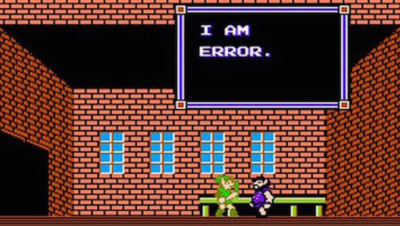

# SQL Joins and Test-Driven Development

## Description

Add a database to the CRUD app you built last weekend. Just worry about creating and reading data for now -- we can leave updating and deleting alone for now. You must have separate tables storing users and whatever entries your app is tracking. Keep in mind that "entries" is a generic term; in the Beer Tracker, for example, this refers to the beers.

## Requirements

* Create an `insertUser` method, which creates a new record in the `users` table.
* Create a `selectUser` method, which returns a `User` object for the given username.
* Create a test for `insertUser` and `selectUser`.
* Create an `insertEntry` method, which creates a new record for the thing you're tracking.
* Create a `selectEntry` method, which returns a new object for the given id.
  * This query should use an `INNER JOIN` between your users and entries table.
* Create a test for `insertEntry` and `selectEntry`.
* Create a `selectEntries` method, which returns an arraylist of all objects you are tracking.
  * This query should use an `INNER JOIN` between your users and entries table.
* Create a test for `selectEntries`.
* Remove your global arraylist/hashmap that stores users and entries.
* Use your five new methods in your project so it now is backed by a database.
* Optional: Make editing and deleting work with the database as well.
