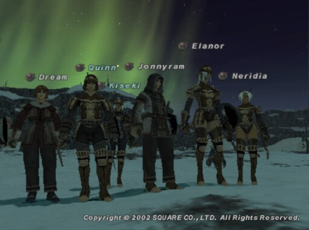

# SQL Paging

## Description

Add database support to your `People Web` project. Create a database with a table called `people` that can store all the information from the CSV. Write a method that reads from the CSV and inserts a record for each person into the table. Then make the app use the database. Finally, implement paging in the database query.

## Requirements

* Create a connection to your database.
* Write a method `createTables` which takes the database connection. Run it right after you create your connection. It should execute two things:
  * Calls `DROP TABLE IF EXISTS people`
  * Calls `CREATE TABLE people (id IDENTITY, first_name VARCHAR, last_name VARCHAR, email VARCHAR, country VARCHAR, ip VARCHAR)`
* Write a method called `insertPerson` which takes the database connection and the columns (don't bother passing `id`, we'll have our database generate the `id` automatically like usual).
* Write a method called `selectPerson` which takes the database connection and an `id` and returns a `Person`.
* Set up your `test` directory and write a test called `testPerson` which tests both of the aforementioned methods.
* Write a method called `populateDatabase` which takes the database connection, then parses the CSV file and inserts each row into the database.
  * You already have code that parses it (the for loop), so just re-use that.
* Write a method called `selectPeople` which takes the database connection and returns an `ArrayList<Person>` of everything from the database.
* Write a test called `testPeople` that tests `selectPeople`.
* Modify `selectPeople` to accept an `int offset` as an argument. Use `LIMIT 20 OFFSET ?` in your SQL query and pass the `offset` to your `PreparedStatement`.
* Remove the global `ArrayList<Person>`.
* Make the `/` route use `selectPeople(conn, offsetNum)` to get the `ArrayList<Person>`. No need to use the `subList` stuff anymore.
* Make the `/person` route use `selectPerson(conn, idNum)` to get the `Person`.
