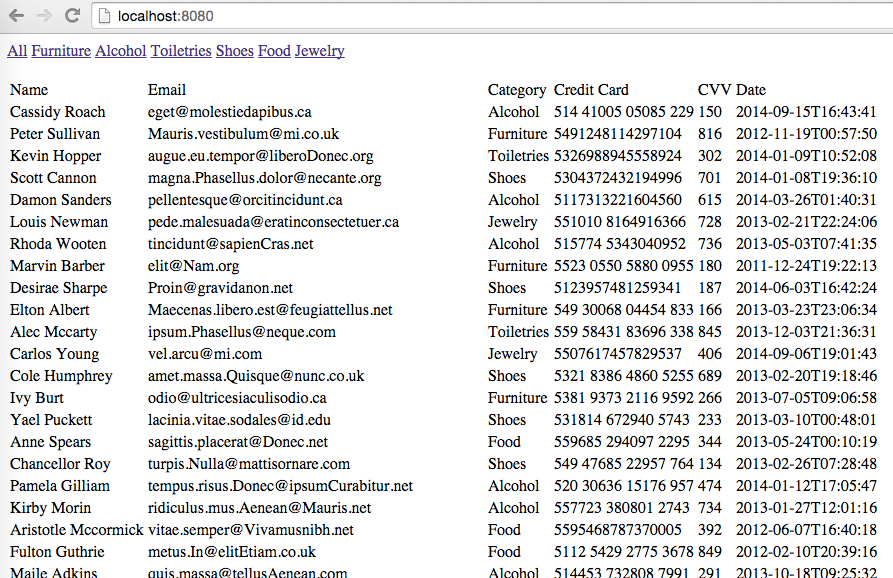

# ORM, OMG!

## Description

Parse the two csv files and store them in PostgreSQL via Spring Data. Then display the purchases along with the name and email of the customer who made them using the entity joining capability of Spring Data.

## Requirements

* Create a project from the Spring template
  * Go to [Spring Initializr](https://start.spring.io/)
  * Choose "Gradle Project"
  * Group is `com.theironyard` and artifact is `Purchases`
  * Click "Switch to the full version"
  * Check the following options:
    * Web
    * JPA
    * Mustache
    * PostgreSQL
  * Download and unzip the project
  * Import into IntelliJ
  * Choose "Import project from external model" and select Gradle
  * Click Next and Finish
* Create a database in PostgreSQL and add the appropriate settings to your `application.properties`
* Copy the CSV files into your project's root directory
  * From Github, you can click each one and click the "Raw" button, then save it to your computer
* Create an empty `home.html` template and a `/` route in your controller to serve it
* Create `Customer` and `Purchase` classes that can hold all the info from their respective CSVs, along with an id (add the appropriate annotations so it can be used with Spring Data)
  * The `Purchase` class should also have a `Customer` field which will serve to join the two tables together
  * You *don't* need to store the `customer_id` in your `Purchase` class, because the join system will create that column for you
* Create `CustomerRepository` and `PurchaseRepository` interfaces that can act as Spring Data repositories for the aforementioned classes
* In your controller, create a `@PostConstruct` method called `init` to parse the CSV files
  * For each CSV file, you should loop over each line, parse each column into a `Customer` or `Purchase` object, and add it to a repository
  * Make it so this *only* happens when the repositories are empty
* Edit `home.html` and the `/` route to make it display the purchases
  * It should display the results in an HTML table so the columns line up (see screenshot below)
  * You should be able to see the name and email from the customer table, and the category, credit card, cvv, and date fields from the purchase table
* Filter the table by category via a query parameter
  * In `PurchaseRepository`, add a method that finds `Purchase` objects by category
  * Modify your `/` route to take a `category` parameter
  * If the parameter isn't null, call the method you made instead of `findAll`
  * Displays links at the top that allow you to filter by each category

